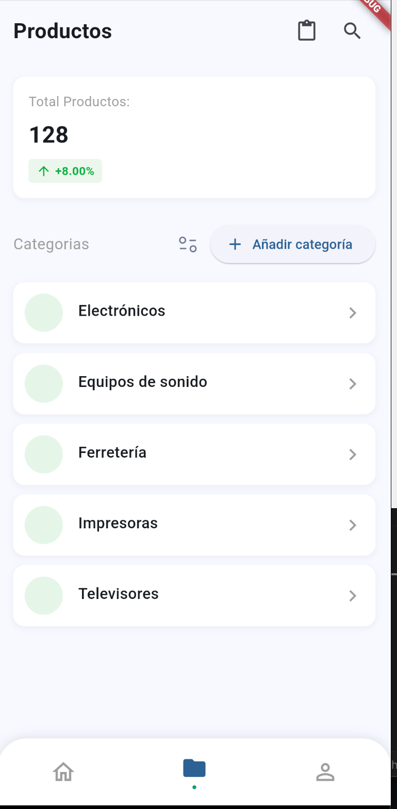
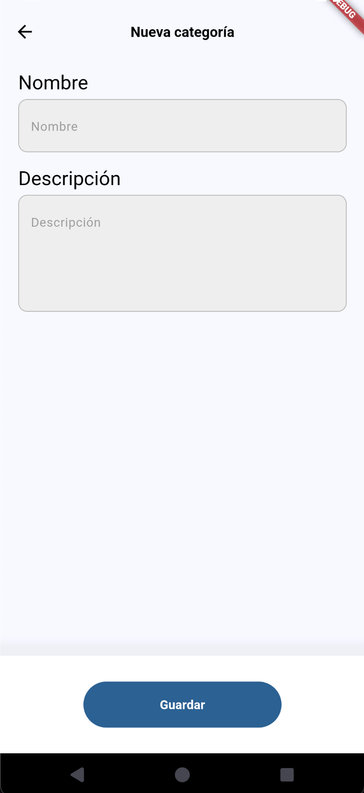
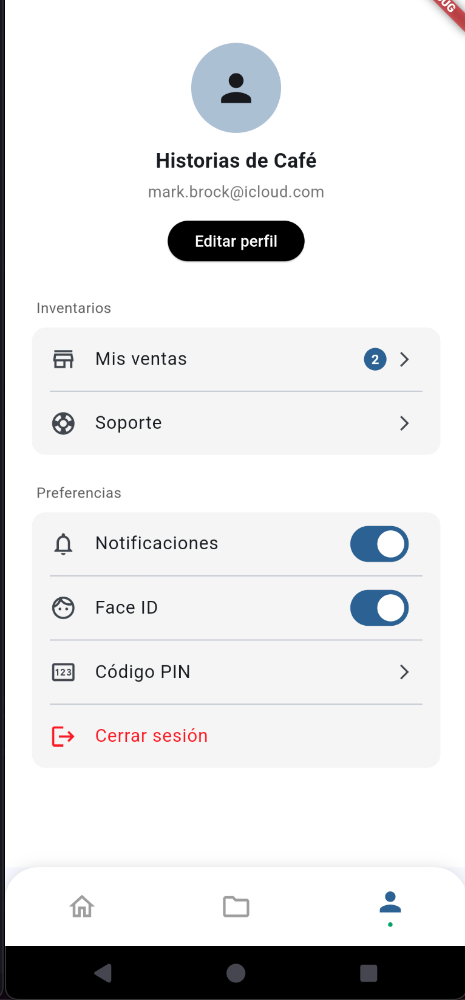
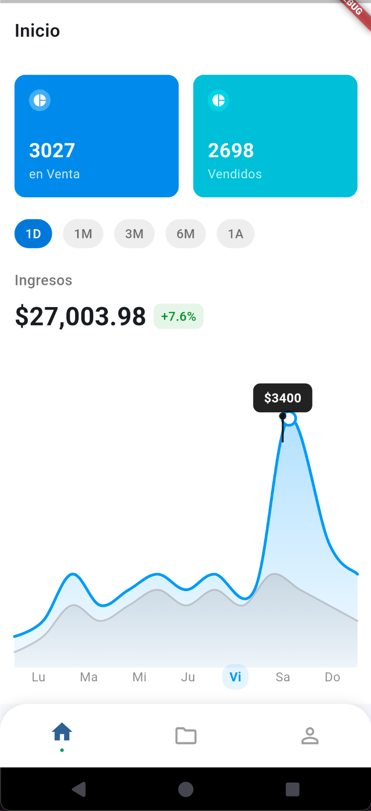
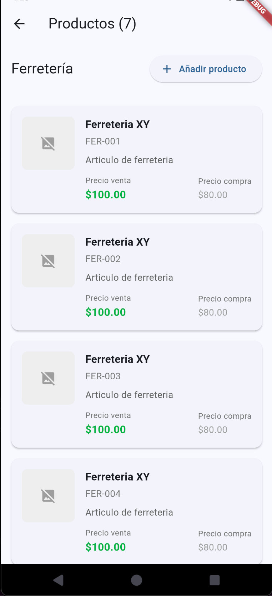

# Flutter POS

**VIDEO EXPLICATIVO:** https://drive.google.com/file/d/1Dt4yC0m99k_p6ia13DjnDr-hRsmVaCU3/view?usp=sharing


Una moderna aplicación de Punto de Venta construida con Flutter, que cuenta con una arquitectura limpia y una interfaz de usuario interactiva para la gestión de productos.

## Capturas de pantalla

<div style="display: flex; flex-wrap: wrap; justify-content: space-between;">
  
  
  
  
  
</div>

## Características

- **Panel de Inicio**: Visualiza estadísticas de ventas, transacciones recientes e indicadores clave de rendimiento
- **Gestión de Productos**: Navega, busca, filtra y administra tu inventario de productos
- **Perfil de Usuario**: Gestiona la configuración y preferencias de la cuenta

## Arquitectura y Tecnologías

Esta aplicación está construida usando:

- **Flutter 3.5+**
- **Dart 3.5+**
- **Arquitectura Limpia (Clean Architecture)** con una clara separación de:
  - Capa de presentación (UI)
  - Capa de dominio (Lógica de Negocio)
  - Capa de datos (Integración de API, repositorios)
- **Patrón BLoC** usando flutter_bloc 8.1.1 para gestión de estados
- **Inyección de Dependencias** para mejor testabilidad y separación de responsabilidades
- **Pruebas Unitarias** con mockito, bloc_test y otras herramientas de testing

## Pruebas Unitarias (Unit Testing)

La aplicación cuenta con pruebas unitarias que cubren:
- Pruebas de BLoCs para garantizar el flujo correcto de estados
- Pruebas de repositories para validar la comunicación con APIs
- Pruebas de use cases para asegurar la lógica de negocio
- Pruebas de integración para comprobar el funcionamiento conjunto de componentes

Para ejecutar las pruebas unitarias:

```bash
flutter test
```

## Primeros Pasos

### Requisitos Previos

- Flutter SDK 3.5 o superior
- Dart SDK 3.5 o superior 
- Un IDE (VS Code, Android Studio, etc.)
- El servidor backend en ejecución

### Configuración del Backend

**IMPORTANTE**: Esta aplicación requiere un servidor backend para funcionar correctamente. 

1. Configura e inicia el servidor backend primero
2. Configura el punto de conexión de la API en `lib/core/config/api_config.dart`:

```dart
class ApiConfig {
  /// URL base para la API
  /// Reemplaza esto con la dirección IP o nombre de host de tu servidor backend
  static const String baseUrl = 'http://<TU_IP_O_HOSTNAME>:3000';
}
```

Reemplaza `<TU_IP_O_HOSTNAME>` con la dirección IP o nombre de host real de tu servidor.

### Instalación

1. Clona el repositorio:
```bash
git clone https://github.com/paolojoaquinp/flutter_pos.git
```

2. Navega al directorio del proyecto:
```bash
cd flutter_pos
```

3. Instala las dependencias:
```bash
flutter pub get
```

4. Ejecuta la aplicación:
```bash
flutter run
```

## Estructura de Módulos

La aplicación sigue una estructura modular basada en características:

- **App Shell**: Shell de navegación principal con navegación inferior
- **Pantalla de Inicio**: Panel con datos de ventas e indicadores clave
- **Pantalla de Productos**: Implementa arquitectura limpia con:
  - Capa de presentación: Componentes UI y gestión de estado con BLoC
  - Capa de dominio: Lógica de negocio y casos de uso
  - Capa de datos: Integración de API y repositorios de datos
- **Pantalla de Perfil**: Gestión de perfil de usuario y configuración
- **Compartidos**: Componentes comunes, utilidades y widgets utilizados en varias características

## Licencia

[MIT](https://choosealicense.com/licenses/mit/)

## Soporte

Para soporte, por favor crea un issue en el repositorio o contacta al mantenedor del proyecto.
